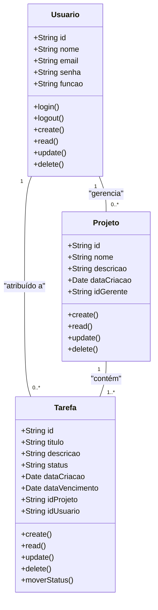
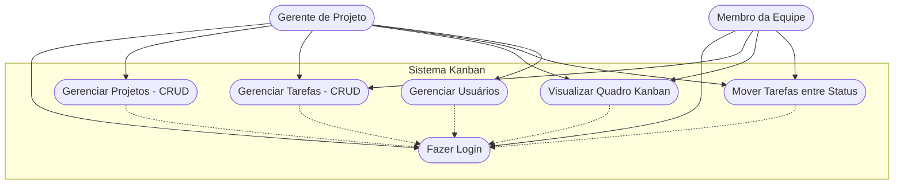
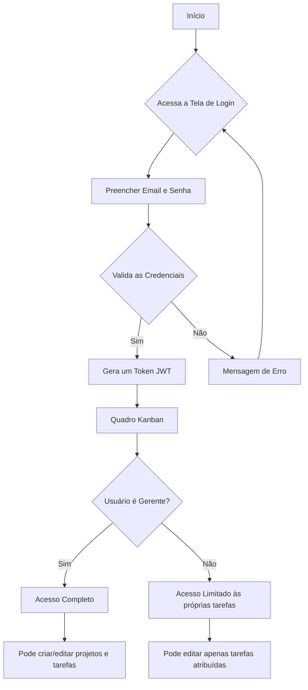

# Gerenciador de Tarefas para Times (Estilo Kanban)

## Briefing

### Visão Geral do Projeto
O projeto consiste no desenvolvimento de um Sistema de Gerenciamento de Tarefas no formato Kanban para a "Agência Criativa StartUp", permitindo uma visualização clara do fluxo de trabalho e status das tarefas.

## Escopo

- ### Objetivos:
  - Centralizar a distribuição e acompanhamento de tarefas
  - Fornecer visibilidade clara do status das atividades
  - Melhorar a organização e produtividade da equipe

- ### Público-Alvo:
  - Gerente de Projeto
  - Membro da Equipe

- ### Recursos Tecnológicos:
  - Frontend: React.js com funcionalidade drag-and-drop
  - Backend: Node.js com Express
  - Banco de Dados: MongoDB
  - Autenticação: JWT

## Diagramas

### 1. Diagrama de Classes



#### Explicação do Diagrama de Classe
- Um **Usuário** pode ser atribuído a várias **Tarefas**
- Um **Projeto** contém várias **Tarefas**
- Um **Usuário** (Gerente) pode gerenciar vários **Projetos**

### 2. Diagrama de Caso de Uso



#### Explicação:
- **Gerente de Projeto**: Tem acesso completo ao sistema (CRUD de projetos, tarefas, usuários e quadro Kanban)
- **Membro da Equipe**: Pode gerenciar suas tarefas e visualizar/mover no quadro Kanban

### 3. Diagrama de Fluxo (Login e Acesso ao Quadro Kanban)



---

## Análise de Risco

### Matriz de Análise de Risco do Projeto Kanban

| ID  | Risco                                     | Probabilidade | Impacto | Mitigação |
|-----|-------------------------------------------|---------------|---------|-----------|
| 1   | Complexidade da funcionalidade drag-and-drop | Média       | Média   | Utilizar bibliotecas consolidadas (ex: React DnD) e testar extensivamente em diferentes dispositivos |
| 2   | Dados sensíveis expostos entre usuários    | Média         | Alto    | Implementar controle de acesso rigoroso e verificar permissões em todas as operações |
| 3   | Performance com muitos projetos/tarefas    | Alta          | Média   | Implementar paginação, virtualização de listas e carregamento sob demanda |
| 4   | Usuários movem tarefas incorretamente      | Alta          | Baixo   | Implementar histórico de alterações e funcionalidade de desfazer |
| 5   | Resistência da equipe em adotar nova ferramenta | Média     | Alto    | Treinamento adequado, interface intuitiva e demonstração de benefícios |
| 6   | Perda de dados durante movimentação de tarefas | Baixa      | Alto    | Sistema de autosalvamento e confirmações para ações críticas |

---

## Prototipagem

### Telas Principais:
- **Tela de Login**: Única para todos os usuários
- **Dashboard/Quadro Kanban**: Visualização principal com colunas:
  - A Fazer
  - Em Andamento  
  - Concluído
- **Gestão de Projetos**: CRUD de projetos (apenas gerentes)
- **Gestão de Tarefas**: CRUD de tarefas
- **Gestão de Usuários**: CRUD de usuários (apenas gerentes)

### Funcionalidade Bônus:
- **Drag-and-drop** para mover tarefas entre colunas
- **Notificações em tempo real** para atualizações
- **Filtros** por projeto, usuário e data

---

## Estrutura do Projeto

```
kanban-system/
├── frontend/
│   ├── src/
│   │   ├── components/
│   │   │   ├── KanbanBoard/
│   │   │   ├── TaskCard/
│   │   │   └── ProjectManager/
│   │   ├── pages/
│   │   │   ├── Login/
│   │   │   ├── Dashboard/
│   │   │   └── Projects/
│   │   └── utils/
├── backend/
│   ├── controllers/
│   ├── models/
│   ├── routes/
│   └── middleware/
└── database/
    └── models/
```